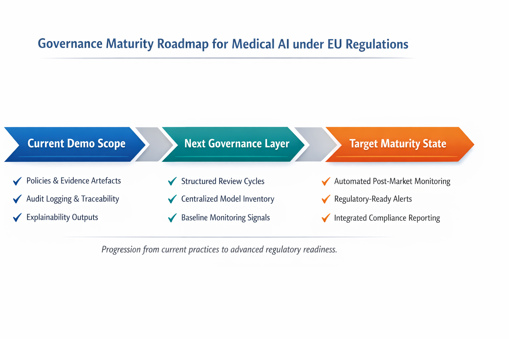

# EU AI Act & Medical AI Governance Demo
*A governance-oriented demonstration for high-risk medical AI (EU-only).*

---

## 1. Objectives of the Demo

### 1.1 Objective 1 — Regulatory gap (already in force)
To highlight the **structural gap between existing enterprise AI systems** and the requirements of the **EU AI Act, which is already in force**. Many deployed systems were designed before high-risk AI obligations became legally binding.

### 1.2 Objective 2 — Key provisions and their system impact
To identify **key EU AI Act provisions** that healthcare organizations must address, and to explain how these provisions affect **system design, operations, and governance**.

Key focus articles include:
- **Art. 6** — High-Risk AI classification  
- **Art. 12** — Record-keeping and audit logging  
- **Art. 13 & 14** — Transparency and human oversight  
- **Art. 15** — Accuracy, robustness, and risk control  

### 1.3 Objective 3 — Traceability as governance (not just engineering)
To demonstrate why **traceability and lineage are governance challenges**, not merely technical ones—especially in heterogeneous deployment environments (multiple runtimes, data formats, and processing frameworks).

### 1.4 Objective 4 — Explainability + fairness for black-box risk
To address transparency and fairness challenges in “black-box” models (e.g., deep learning), and to show how **explainability and bias analysis** support EU AI Act requirements.

### 1.5 Objective 5 — From obligations to evidence and policies
To show how regulatory obligations can be **operationalized** as **auditable evidence and explicit policies**, rather than remaining abstract compliance statements.

---

## 2. EU AI Act: Key Obligations & Governance Gaps

**Important context:** The EU AI Act is **already in force**. This demo translates obligations into **system-level implications** and clarifies **consequences** if organizations do not align.

| Obligation area | EU AI Act reference | System-level impact | Consequences if not addressed |
|---|---|---|---|
| High-risk classification | Art. 6, Annex III | Medical AI is typically high-risk even for decision support | Misclassification risk, enforcement action, penalties |
| Risk management | Art. 9 | Requires structured, ongoing risk governance | Findings of inadequate controls; safety and liability exposure |
| Record-keeping & auditability | Art. 12 | Decisions must be reconstructable (who/what/when/why) | Inability to defend decisions under audit or incident review |
| Transparency | Art. 13 | Users must understand system role, limits, and outputs | Misuse, incorrect reliance, safety risk |
| Human oversight | Art. 14 | Oversight must be enforceable (not symbolic) | System treated as unlawfully autonomous in practice |
| Accuracy & robustness | Art. 15 | Safety/stability prioritized over peak performance | Restrictions, corrective actions, withdrawal of use |

**Core shift:** governance moves from **global assurances** (“we operate responsibly”) to **local, evidence-based accountability** (“this model, this decision, this context”).

---

## 3. Demo Positioning

This demo is positioned as a **governance-oriented demonstration for high-risk medical AI under the EU AI Act**.

It does not aim to showcase state-of-the-art model performance, benchmark results, or production-scale optimization.  
Instead, it focuses on how AI systems can be made **accountable, explainable, and auditable** in regulated medical contexts.

All components in this demo—**datasets, models, execution environments, and explainability outputs**—are framed as **inputs to governance**, not as ends in themselves.

The demo is designed to answer governance-relevant questions such as:

- Where did the data come from?
- How was a specific decision produced?
- Can this behavior be reviewed, explained, and audited?
- Who is responsible for oversight and corrective action?

This positioning aligns the demo with the **EU AI Act’s emphasis on accountability, transparency, and human oversight**, rather than technical novelty.

### 3.1 Data Sources (Representative, Non-Claim)

The datasets used in this demo are **publicly available benchmark datasets**, primarily sourced from **Kaggle**, and are used as **representative scenarios** to demonstrate governance challenges:

- **Chest X-Ray Pneumonia datasets** (medical imaging)
- **Stroke risk datasets** (tabular clinical-style data)
- **Breast Cancer Wisconsin dataset** (tabular classification)

These datasets are **not used to make clinical performance claims**.  
Their role is to provide realistic inputs for demonstrating **explainability, traceability, bias signals, and auditability** under high-risk AI governance requirements.

### 3.2 Analysis & Explainability Methods

The demo applies **multiple model types and explainability techniques** to illustrate governance across **heterogeneous AI systems**:

- **Grad-CAM**  
  Used for convolutional neural networks (CNNs) on medical images to generate **visual, case-level explanations** that support human-in-the-loop review and qualitative assessment.

- **SHAP (Global)**  
  Used to analyze **population-level feature importance and directional effects**, supporting system-level transparency and bias inspection.

- **SHAP (Local)**  
  Used to explain **individual predictions**, enabling local justification, documentation, and human override decisions.

Together, these methods demonstrate how so-called **black-box models** can still be subjected to **human review, traceable reasoning, and regulatory scrutiny**.

Explainability outputs in this demo are treated as **governance evidence**, not as proof of clinical validity.

### 3.3 Execution Environment & Pipeline Context

This demo is intentionally executed across **heterogeneous execution contexts** to reflect realistic enterprise conditions, where AI systems rarely operate within a single notebook environment.

#### 3.3.1 Primary Execution Environment (Linux-based Pipeline)

The core workflow is executed on a **native Linux environment**, which serves as the authoritative runtime for:

- Data ingestion and preprocessing  
- Pipeline-style execution  
- Artefact generation (models, logs, explainability outputs)  
- Audit and lineage evidence capture  

The pipeline setup reflects common enterprise components, including:

- **Docker** — containerized, reproducible execution environments  
- **Apache Spark** — data processing workflows with an emphasis on traceability  
- **Apache Kafka** — event-based data flow and message-driven execution contexts  
- **Marquez (OpenLineage)** — capture of data lineage and metadata across datasets and jobs  

These components are used to demonstrate how **governance and auditability must persist across system boundaries**, not to claim production-scale deployment.

#### 3.3.2 Notebook Environments (Evidence Generation Layer)

Interactive notebook environments (e.g. **Google Colab**) are used as a **controlled analysis and evidence-generation layer**, specifically for:

- Model experimentation and explainability analysis  
- Generation of **Grad-CAM**, **SHAP (global and local)**, and bias artefacts  
- Producing reviewable evidence snapshots linked back to pipeline runs  

Notebooks are **not treated as the system of record**.  
They operate downstream of the Linux-based pipeline and consume **traceable artefacts** produced by it.

### 3.4 Governance Implication

By separating:
- a **pipeline-oriented Linux runtime**, and  
- **interactive notebook environments**,  

this demo illustrates that **AI governance must hold across heterogeneous execution contexts**, not just within a single notebook.

Auditability, explainability, and oversight are demonstrated as **system-level properties**, independent of where individual analyses are executed.

---

## 4. Organization Profile & Scope

### 4.1 Organization Profile (Assumed)
This demo is framed from the perspective of a **consulting / AI governance solution provider** supporting organizations in the **healthcare / medical AI** sector.

### 4.2 Scope of This Demo
- **Industry:** Healthcare / Medical AI  
- **Risk category:** High-Risk AI (EU AI Act)  
- **Regulatory context:** **EU-only**  
- **Use case:** Clinical decision support (alerting, non-autonomous)  
- **Out of scope:** Cross-border data transfers and non-EU jurisdictions  

**EU-only definition (operational):**
- Data processing, storage, and governance controls are assumed to remain **within the EU**.
- No cross-border data exchange is considered in this demo’s scope.

---

## 5. Evidence & Policy Mapping

This demo uses a structured evidence framework so obligations can be verified through **auditable artefacts**, not informal claims.

### 5.1 Evidence Categories
- **A-series:** Data flow and lineage artefacts  
- **B-series:** Data governance and metadata  
- **C-series:** Explainability and performance evidence  
- **D-series:** Human oversight, bias indicators, audit logs  

### 5.2 Policy Categories
- **P-series:** Governance policies covering roles, oversight, corrective measures, review cadence, and change control  

This mapping demonstrates how regulatory obligations are translated into **auditable artefacts**, not informal claims.

---

## 6. Conclusion — Medical AI Governance as a Lifecycle Obligation

**The EU AI Act establishes that medical AI governance does not end at deployment.**  
Instead, organizations must be able to:
- **Explain system behavior**
- **Justify decisions locally**
- **Demonstrate ongoing oversight**
- **Adapt governance as regulatory and operational contexts evolve**

In medical contexts, governance is best understood as a **lifecycle obligation**: evidence, policies, and oversight must remain effective as systems, data, and regulatory expectations change over time.

### 6.1 Regulatory Context (Medical AI)
Continuous governance expectations arise from the **combined effect** of multiple regulatory frameworks and standards, including:
- **EU AI Act**
- **GDPR / DSGVO**
- **MDR / IVDR**
- **Data Act**
- **Digital Services Act (DSA)**
- National supervisory guidance (e.g., **BfArM** in Germany)
- **ISO/IEC 42001**

### 6.2 Corrective Measures (Governance Principle)
Corrective measures are **governance-driven, not automatically executed**:
- Governance is adjusted **before** models are modified.
- Model changes require **explicit governance approval**.

### 6.3 Post-Market Monitoring (Signals & Roadmap Reference)
Monitoring signals include:
- Changes in **error patterns**
- **Bias drift** or subgroup gap changes
- Shifts in **explainability patterns**
- Increased frequency of **human overrides**

Full automation is not claimed; maturity is addressed in the **Future Outlook roadmap**.

---

## 7. Future Outlook — Governance Maturity Roadmap (Visual)

*AI-assisted diagram generated by ChatGPT (GPT-5.2) under human supervision.*

---

## 8. Supplementary Notes & Disclaimer

### 8.1 Educational and Governance Demonstration
This demo is provided **for educational and governance demonstration purposes only**.

### 8.2 AI-assisted Development & Accountability Disclosure
Prepared with assistance from **ChatGPT (GPT-5.2)** under full human review and responsibility.
